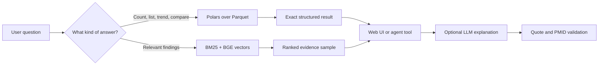
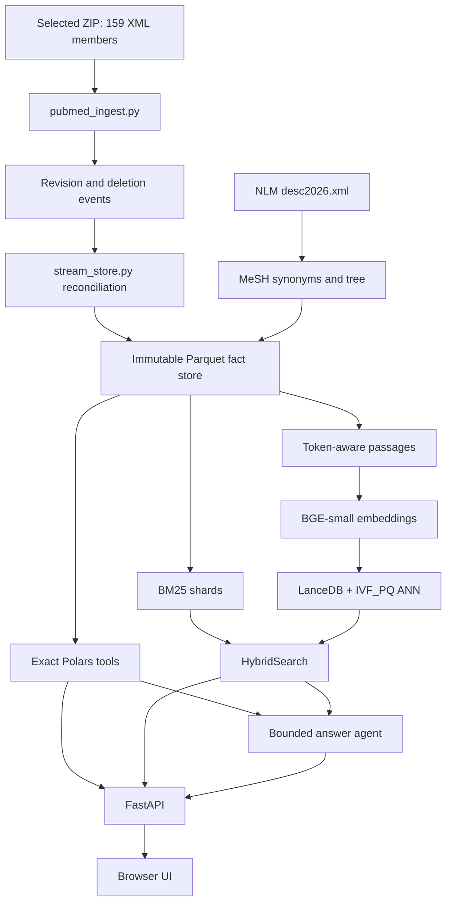

# PubMed Literature Intelligence — complete beginner walkthrough

This guide explains the project as if you are seeing it for the first time. It
is written against branch `covid-files`, commit `6717cea`. The code can move after
that commit, so use function names as the permanent reference and line numbers as
a quick navigation aid.

The project has roughly 3,500 lines of production Python, a single-page web UI,
deployment scripts, notebooks and tests. Explaining every physical line as an
isolated sentence would hide the design under thousands of repeated comments.
This guide instead explains every production file and every production function,
in execution order, and groups adjacent lines that perform one operation. That is
the useful meaning of a line-by-line walkthrough.

## 1. What you built

You built a no-SQL biomedical literature intelligence system over a selected
PubMed XML archive. It:

1. streams 159 XML members directly from a ZIP;
2. parses and reconciles revisions and deletions;
3. stores structured facts as compressed Parquet files;
4. builds a BM25 keyword index;
5. creates BGE embeddings for token-bounded evidence passages;
6. stores and searches those vectors with LanceDB and a compressed ANN index;
7. combines keyword and semantic results into one ranked evidence list;
8. calculates exact structured analytics with Polars;
9. lets an answer LLM call bounded tools and cite verified PubMed excerpts;
10. serves everything through FastAPI and a professional browser interface;
11. packages the 18.66 GB verified data release separately from application code.

The selected immutable snapshot is `6f269c0288fb98ea0c96`. It contains
3,217,739 current article records and 6,290,649 searchable passages. It came from
the supplied 159-file archive. It is not all of PubMed and it is not a full-text
article collection.

### A 30-second explanation

> I built a literature intelligence system over a supplied PubMed snapshot. It
> uses Parquet and Polars for exact analytics, BM25 plus BGE embeddings and
> LanceDB for hybrid evidence retrieval, and a bounded tool-calling LLM for
> source-grounded explanations. Every release is tied to an immutable snapshot
> and checksum inventory, so the API, indexes and source facts cannot silently
> drift apart. The system uses no SQL database.

### A two-minute explanation

> Raw PubMed is XML, so the first problem is reliable ingestion rather than AI.
> My pipeline streams each XML member from the ZIP and converts each article into
> normalized facts such as articles, authorships, MeSH headings, substances and
> citations. It preserves source order so later revisions replace earlier child
> data and deletion records actually remove papers. The reconciled result is an
> immutable Parquet snapshot.
>
> I then created two query lanes. Exact questions such as journal counts and
> publication trends are calculated directly with Polars. Open-ended questions
> use hybrid retrieval: BM25 finds matching words and BGE embeddings find similar
> meaning. Reciprocal-rank fusion combines them, while LanceDB's IVF_PQ ANN index
> makes vector search practical. The UI always distinguishes exact totals from a
> ranked evidence sample.
>
> The LLM does not contain or retrain on the corpus. It receives the question,
> chooses approved tools, and sees only bounded results or retrieved excerpts.
> Numeric outputs are rendered directly. Evidence quotations must be exact text
> from a retrieved PMID or the answer is retried or refused. Deployment downloads
> a pinned Hugging Face data commit and verifies every size and SHA-256 checksum
> before starting the API.

## 2. The most important design: two query lanes



These lanes must stay separate:

- **Structured analytics** scan the selected records and return exact values for
  the supported scope. Example: “How many records mention this MeSH concept by
  year?”
- **Evidence retrieval** ranks a small set of likely relevant passages. Example:
  “What do papers report about long COVID fatigue?” A top-20 list is useful, but
  it is not the number of all matching papers.

The LLM sits after these tools. It does not make a count exact and it does not
turn a ranked sample into complete coverage.

## 3. Vocabulary you should know

| Term | Plain meaning | Use in this project |
|---|---|---|
| XML | Tagged text format | The supplied PubMed source format. |
| PMID | PubMed record identifier | The stable source key used to join facts and citations. |
| Parquet | Compressed column-oriented file | Stores large fact tables without a database server. |
| Polars | DataFrame engine | Lazily filters, joins and aggregates Parquet data. |
| Corpus/collection | The records available to this app | Here it means the selected 3,217,739 records, not all PubMed. |
| Snapshot | Immutable version of data | A digest derived from source events and terminology input. |
| Manifest | Small JSON description of artifacts | Selects a snapshot and records whether an index is complete. |
| Checkpoint | Durable progress marker | Lets ingestion or embedding safely resume after interruption. |
| BM25 | Word-based relevance formula | Finds records containing important query words. |
| Token | A model's text unit | Passages are limited by model tokens rather than characters. |
| Embedding | Numeric meaning representation | BGE maps a query and passage into comparable 384-number vectors. |
| BGE | Embedding model family | `BAAI/bge-small-en-v1.5` creates retrieval vectors; it is not the answer LLM. |
| Vector search | Nearest-neighbour search | Finds passages whose vectors are close to the query vector. |
| LanceDB | File-backed vector database/library | Stores vectors and executes vector/ANN searches without SQL. |
| ANN | Approximate nearest neighbour | Searches a compressed index quickly instead of scanning every vector. |
| IVF_PQ | ANN compression/index method | Groups vectors and compresses them; selected settings preserve measured smoke-query recall. |
| RRF | Reciprocal rank fusion | Combines BM25 and vector ranks without pretending their raw scores are comparable. |
| MeSH | NLM controlled vocabulary | Provides stable biomedical concept IDs, names, synonyms and hierarchy. |
| RAG | Retrieval-augmented generation | Retrieves evidence first, then lets an LLM explain only that evidence. |
| Agent/tool calling | Model selects named functions | The answer model can call only registered project tools within budgets. |
| Citation | A source link or reference edge | UI citations are PMIDs/quotes; “cited within collection” counts internal reference edges only. |
| Role score | Publication-role ranking | Default formula: papers + 1.5× first-author papers + 2× senior-author papers + recent papers. It is not clinical quality. |

## 4. End-to-end architecture



There are four layers:

1. **Build layer** — reads source files and creates versioned artifacts.
2. **Retrieval/analytics layer** — answers deterministic queries over artifacts.
3. **Application layer** — exposes HTTP endpoints and the browser UI.
4. **Deployment layer** — verifies and activates a pinned published release.

## 5. Repository map

| Path | Responsibility | Runs in production? |
|---|---|---|
| `pipeline/dataset.py` | Selects and locks the active immutable dataset. | Yes |
| `pipeline/pubmed_ingest.py` | Parses PubMed XML into normalized rows/events. | Build only |
| `pipeline/stream_store.py` | Reconciles revisions/deletions and writes Parquet. | Build only |
| `pipeline/build_store.py` | Schemas, legacy CSV conversion and vocabulary build. | Build only |
| `pipeline/load_mesh_synonyms.py` | Builds terminology synonym/tree files. | Build only |
| `pipeline/retrieval.py` | BM25, passage chunking, embeddings and hybrid search. | Yes |
| `pipeline/embedding_shards.py` | Resumable multi-GPU embedding parts and ANN finalization. | Build only |
| `pipeline/tools.py` | Exact analytics and typed LLM tools. | Yes |
| `pipeline/evidence.py` | Request budgets, payload bounds and citation validation. | Yes |
| `pipeline/agent.py` | Local/cloud answer-model loop. | Yes |
| `pipeline/app.py` | FastAPI endpoints and UI hosting. | Yes |
| `pipeline/static/index.html` | Complete browser interface: HTML, CSS and JavaScript. | Yes |
| `pipeline/manage.py` | One CLI for status, serving, indexes and releases. | Operator tool |
| `pipeline/evaluate.py` | Reviewed-case retrieval/answer evaluation. | Evaluation only |
| `pipeline/eval_slice.py` | Creates small evaluation data slices. | Evaluation only |
| `pipeline/xml_profiler.py` | Inspects unfamiliar XML before writing an importer. | Research/build tool |
| `deploy/fetch_data.py` | Downloads and verifies a pinned data release. | Cloud startup |
| `deploy/upload.py` | Publishes data and Space code to explicit repositories. | Deployment tool |
| `deploy/Dockerfile` | Defines the Hugging Face Space container. | Cloud build |
| `start_all.ps1` | Safely loads local LLM settings and starts the app. | Local startup |
| `add_files.ps1` | Rebuilds data/BM25 from an explicitly chosen source. | Local build |
| `progress.ps1` | Prints selected snapshot/build/index state. | Operator tool |
| `view.py` | Human-readable Parquet preview/export. | Operator tool |
| `tests/` | Regression, ingestion, retrieval, ANN and UI checks. | Validation |
| `colab/`, `kaggle/` | Free-GPU embedding workflows. | External build environments |
| `research/` | Measurements, decisions and validation evidence. | Documentation |
| `covid-files/dataset.json` | Pointer to the active local snapshot. | Yes |
| `covid-files/stores/...` | Generated structured data. | Yes, published separately |
| `covid-files/indexes/...` | Generated BM25/vector artifacts. | Yes, published separately |

Generated `.parquet`, BM25 and LanceDB files are data artifacts, not source-code
lines. `llm.env` is a private runtime secret file and must never be committed,
shown in a demo or copied into documentation.

## 6. The stored data model

`pipeline/build_store.py` lines 16–31 define the 12 source fact tables.

| Table | One row means | Important fields |
|---|---|---|
| `articles` | one current PubMed record | PMID, title, abstract, year, DOI, PMCID, revision date |
| `journals` | one journal identity | NLM ID, title, abbreviation, ISSN, country |
| `authors` | one provisional author identity | generated key, name parts, ORCID, group flag |
| `authorships` | one author position on one paper | PMID, author key, position, first/last flags, affiliation |
| `mesh_headings` | one paper-to-MeSH association | PMID, descriptor ID/name, major-topic flag, qualifiers |
| `substances` | one named chemical association | PMID, substance ID/name, registry number |
| `keywords` | one author keyword | PMID, term, major-topic flag |
| `citations` | one reference edge | citing PMID, cited PMID |
| `publication_types` | one paper/type association | PMID, type ID and name |
| `grants` | one grant association | PMID, grant ID, agency, country |
| `databank_links` | one external registry link | PMID, registry name, accession such as NCT ID |
| `deleted_pmids` | one currently deleted record | PMID |

`vocabulary.parquet` is derived from MeSH headings, substances and author
keywords. `synonyms.parquet` and `mesh_tree.parquet` are derived from NLM MeSH
descriptor XML. They improve concept matching but do not change the articles or
require re-embedding.

## 7. What happens during a full data build

1. `stream_store.build()` selects the ZIP and computes source identity.
2. `source_jobs()` lists XML/gzip members in deterministic order and rejects
   ambiguous duplicate member names.
3. `events()` parses records incrementally. It never loads all XML in RAM.
4. `handle_article()` emits normalized rows for the article and each child fact.
5. Events carry source order, ordinal, revision date and content identity.
6. Completed members receive an atomic checkpoint. A broken member is not marked
   complete, so restart repeats it safely.
7. Events are divided by a stable PMID bucket. Only one bucket is reconciled at
   a time to bound memory.
8. Later source events win. Revisions replace all child collections; deletions
   remove a record; a later record can reintroduce it.
9. Each fact table is deduplicated and written with Zstandard compression.
10. MeSH synonym/tree files and the combined vocabulary are generated.
11. A snapshot-specific store manifest is written atomically.
12. Only then is `dataset.json` switched to `status: ready`.

The design prevents four subtle bugs: partial members being treated as complete,
old child rows surviving a revision, deletion order being ignored, and an API
loading data from one snapshot with indexes from another.

## 8. What happens during indexing

### BM25

`build_bm25()` reads article batches, makes searchable title/abstract documents,
and writes 161 resumable shards for the full collection. Title-only articles are
included. A complete manifest records the corpus snapshot and all ready shards.
The service refuses a partial or mismatched lexical index.

BM25 is strong when the query contains exact words, names, drug terms or PMIDs.
Its score depends on term rarity, term frequency and document length.

### Embeddings

`token_passages()` uses the BGE tokenizer's character offsets. Each passage fits
the model limit, adjacent passages overlap, and the last part of a long abstract
is retained. This fixed a common truncation error where conclusions disappear.

`BAAI/bge-small-en-v1.5` produces a normalized 384-dimensional vector per
passage. The model is pretrained; this project performs embedding inference, not
fine-tuning. The full run created 6,290,649 passage vectors.

`embedding_shards.py` writes small checksummed parts. Every part records the
snapshot, model revision, chunk policy and worker assignment. Interrupted Kaggle
or Colab runs can resume, and finalization refuses missing, duplicate or mismatched
coverage.

### LanceDB and ANN

LanceDB stores the vectors as a local table. The project then builds an IVF_PQ
index with 2,508 partitions and 48 sub-vectors. Search probes 64 partitions and
refines 10 times the requested candidates. Those are measured settings, not
arbitrary constants: seven smoke queries matched exact vector top-10 while the
historical vector lookup fell from about 18.5 seconds to about 0.1 seconds.

ANN is approximate, so `PUBMED_USE_ANN=0` exists for exhaustive audits. The UI
and health response disclose whether the vector path is complete or unavailable.

### Hybrid ranking

For one query, `HybridSearch.search()`:

1. applies supported year/concept restrictions before final candidate ranking;
2. obtains BM25 candidates;
3. embeds the query and obtains vector candidates when the verified vector model
   and matching revision are available;
4. combines ranks using reciprocal-rank fusion;
5. optionally applies an explicitly configured cross-encoder reranker;
6. attaches source passages and article metadata;
7. returns the retrievers used, timing, vector status and a ranked result list.

If query embedding fails, keyword search remains available and the response says
the service is degraded. It never labels lexical-only results as full hybrid.

## 9. What happens when the user searches “covid”

1. `search()` in the browser validates text and years and invalidates stale Ask
   answers.
2. `/api/resolve?q=covid` calls `resolve_concept()` and related-concept logic.
3. The UI displays distinct concept chips such as COVID-19 and SARS-CoV-2. They
   are related, not merged into one medical concept.
4. The user may select a chip. That selected `concept_id`, not the typed text,
   scopes exact analytics.
5. The Evidence tab calls `/api/search` with the text, result limit, year range
   and optional concept.
6. FastAPI validates input, calls `HybridSearch`, measures time and returns JSON.
7. The UI escapes all source strings before inserting them into HTML, renders
   evidence passages and links every result to its PMID/PubMed record.
8. Research overview and Entities call separate exact endpoints in parallel.
   Without a chosen chip they cover the whole selected collection/year range.

This explains the message “typed search alone does not filter this view.” Free
text ranks evidence; a recognized selected concept gives a stable definition for
exact corpus calculations.

## 10. What happens in Ask

1. The browser sends the question and selected filters to `/api/ask`.
2. `app.py` verifies that an answer model is explicitly configured.
3. `agent.run()` creates a new `RequestState`; no previous user's tool state is
   reused.
4. The system prompt tells the model that source text is untrusted data, only
   supplied tools may be used, and filters cannot be silently discarded.
5. The LLM chooses a registered typed tool. It never receives arbitrary Python,
   filesystem or web access.
6. `RequestState.execute()` blocks duplicate calls and enforces tool, time and
   payload budgets.
7. Exact count/list tools are rendered deterministically, preserving valid zero.
8. Finding questions use `search_literature` and return candidate evidence.
9. The model proposes JSON containing PMID and quotation.
10. `render_quotes()` checks that every quotation is verbatim text associated
    with that retrieved PMID. Invented or modified quotes fail validation.
11. The agent can retry within its limits; otherwise it returns insufficient
    evidence rather than a plausible unsupported answer.
12. The response includes model, provider, elapsed time, filters and tool-call
    metadata for the UI.

The answer LLM and BGE embedding model have different jobs. BGE retrieves; the
LLM explains. Changing the LLM does not require rebuilding embeddings.

## 11. Production code walkthrough by file and line range

### `pipeline/dataset.py` — immutable dataset selection

- **Lines 1–10:** imports, repository root, default manifest and serving pin.
- **13–14 `digest`:** canonicalizes a Python value to sorted compact JSON and
  hashes it. Stable input produces stable identity.
- **17–18 `read_json`:** opens UTF-8 JSON and returns a Python object.
- **21–26 `atomic_json`:** writes to a temporary file, flushes it, then replaces
  the destination. A crash cannot leave half a JSON manifest.
- **29–32 `space_guard`:** checks free disk space and stops before crossing the
  configured safety reserve.
- **35–48 `paths`:** resolves dataset precedence, checks `status == ready`, and
  returns store, index and manifest. Missing data fails instead of falling back
  to an old store.
- **51–55 `pin`:** fixes one manifest for the lifetime of the server process so
  requests cannot switch datasets underneath each other.
- **58–83 `BuildLock`:** creates an exclusive OS lock and removes it on exit,
  preventing two writers from building the same dataset simultaneously.

### `pipeline/pubmed_ingest.py` — XML parsing

- **Lines 26–38:** names the 12 emitted fact tables.
- **47–54 `text`:** finds an XML child and joins `itertext()`, preserving inline
  markup text instead of reading only the first text node.
- **57–68 `pub_year`:** tries PubDate year, MedlineDate and other supported date
  fields in order, returning a usable integer or null.
- **71–77 `pub_month`:** normalizes numeric/month-name publication months.
- **80–89 `abstract_text`:** combines labelled abstract sections into searchable
  text.
- **92–103 `author_key`:** prefers ORCID; otherwise creates a normalized
  name-based identity and handles group authors. This fallback is provisional.
- **106–112 `clean_orcid`:** strips URLs/prefixes and accepts only a valid ORCID
  shape.
- **117–248 `handle_article`:** the central parser. It extracts the article,
  journal, author positions and first affiliation, MeSH headings, chemicals,
  keywords, reference PMIDs, publication types, grants and registry accessions.
- **254–266 `open_source`:** opens plain XML, gzip XML or one ZIP member as a
  stream.
- **269–291 `source_jobs`:** returns deterministic file/member jobs, applies an
  optional limit and rejects duplicate logical names.
- **294–324 `process_file`:** creates table writers, incrementally parses one
  source, clears processed XML elements to save RAM and returns the article count.
- **327–358 `main`:** CLI argument parsing, optional parallel processing and
  progress totals.

### `pipeline/stream_store.py` — safe large-corpus reconciliation

- **27–28:** defines owner-partitioned tables. Their rows belong to a PMID and
  must be replaced when that article is revised.
- **32–37 `Rows`:** a tiny in-memory writer compatible with the XML parser.
- **40–71 `events`:** turns article/delete XML into ordered event dictionaries
  and yields bounded batches.
- **74–85 `source_identity`:** fingerprints the source archive/member list so a
  changed input cannot reuse the wrong checkpoints.
- **88–97 `table_frame`:** converts emitted string rows to typed Polars columns.
- **100–107 `output_columns`:** adds source/revision ownership metadata needed
  during reconciliation.
- **110–117 `valid_parquet`:** confirms that a checkpoint part is readable and
  contains expected columns before trusting it.
- **120–147 `finalize_owner_partitioned`:** deduplicates bucket parts without
  collecting all corpus rows globally.
- **150–300 `build`:** coordinates locking, space checks, member checkpoints,
  event batching, PMID buckets, latest-event selection, child replacement,
  global dimensions, terminology, store manifest and final `dataset.json`.
- **303–314:** exposes the build as a CLI with source, output root, file limit,
  bucket count, reserve, sample and MeSH options.

### `pipeline/build_store.py` — schemas and vocabulary

- **16–31 `SCHEMAS`:** exact column order for every table.
- **34–35:** identifies integer and Boolean columns that arrive as CSV strings.
- **42–52 `DEDUP_KEYS`:** defines each fact's logical uniqueness.
- **56–65 `country_from_affiliation`:** removes email noise and takes the final
  comma-separated affiliation segment. It is a disclosed heuristic.
- **68–114 `build`:** legacy CSV-to-Parquet converter; skips legitimate empty
  shards, applies types, deduplicates and compresses every table.
- **117–158 `build_vocabulary`:** groups MeSH, substance and keyword terms into
  the concept lookup surface and records paper frequency for ranking.
- **161–167:** command-line wrapper for the legacy conversion path.

### `pipeline/load_mesh_synonyms.py` — terminology

- **27–28 `open_any`:** opens plain or compressed descriptor XML.
- **31–62 `load`:** writes preferred names, entry-term synonyms and tree numbers
  to snapshot-local Parquet files.
- **65–80 `descendants`:** expands one MeSH descriptor through the tree hierarchy.
- **83–88:** CLI wrapper.

### `pipeline/retrieval.py` — keyword and semantic retrieval

- **17–20 `article_batches`:** lazily streams article frames from Parquet.
- **23–30 `documents`:** converts rows into BM25 documents, optionally limiting
  or truncating for controlled tests.
- **33–67 `build_bm25`:** creates resumable lexical shards and a complete manifest.
- **70–134 `BM25Search`:** validates the manifest, lazily caches shards, warms
  them and searches with filters before top-k selection.
- **137–153 `token_passages`:** creates overlapping model-safe slices from exact
  tokenizer offsets and preserves the text tail.
- **156–173 `lexical_passages`:** chooses useful literal excerpts around query
  matches when semantic passages are unavailable.
- **176–187 `_encoder`:** loads the sentence-transformer with deliberate download,
  device and thread controls.
- **190–253 `build_vectors`:** local resumable vector build; fingerprints the
  generation, upserts idempotently and commits completeness only at full coverage.
- **256–391 `HybridSearch`:** validates matching vector metadata, loads optional
  ANN/reranker, runs keyword/vector searches, fuses ranks and attaches evidence.
- **394–412:** CLI for BM25/vector builds and test queries.

### `pipeline/embedding_shards.py` — portable GPU embedding jobs

- **27–33 `encoder_pool`:** starts sentence-transformer workers on configured GPU
  devices.
- **36–38 `sha256_file`:** hashes each output part.
- **41–49 `article_file` / `batches`:** locates the selected article table and
  creates deterministic row ranges.
- **52–69 `descriptor`:** records snapshot, model revision, tokenizer/chunk policy,
  vector type/dimensions and worker layout.
- **72–89 `make_passages`:** converts article frames into identified passages.
- **92–97 `part_paths`:** calculates stable vector, passage and manifest names.
- **100–122 `manifest_valid`:** confirms metadata, sizes and optionally hashes
  before skipping a completed part.
- **125–129 `write_frame`:** atomically writes one Parquet part.
- **132–224 `run_worker`:** owns deterministic batches, embeds on one/many GPUs,
  writes parts, checkpoints and stops cleanly before a runtime deadline.
- **227–264 `benchmark`:** measures passage expansion, throughput, projected disk
  and projected runtime without committing a full generation.
- **267–307 `expected_parts` / `verify`:** proves all article ranges are covered
  once with compatible descriptors and valid files.
- **310–365 `finalize`:** imports verified vectors into LanceDB, retains external
  evidence text, optionally consumes temporary parts and commits vector metadata.
- **368–390 `_create_ann`:** chooses safe IVF_PQ parameters and creates the index.
- **393–414 `build_ann`:** validates disk/vector state and records ANN completion.
- **417–453:** command-line subcommands: benchmark, worker, verify, finalize, ANN.

### `pipeline/tools.py` — exact research functions

- **27–35 `_t` / `_vocab`:** lazy table loader and cached vocabulary reader.
- **52–86 `_lookup`:** builds the combined preferred-name/synonym lookup.
- **89–138 `resolve_concept`:** normalizes text, scores exact/prefix/contained
  matches and returns the best recognized biomedical concepts.
- **141–171 `related_concepts`:** adds explicit related concepts, including the
  separate COVID-19 and SARS-CoV-2 suggestions.
- **175–209 `_name_index` / `spot_concepts`:** caches normalized names and spots
  named concepts inside longer questions.
- **213–265 `_descendants`, `_pmids_for`, `concept_scope`:** expands MeSH hierarchy,
  builds a PMID scope and reports what that scope means.
- **268–287 `validate_years` / `_scoped`:** checks inclusive year bounds and
  constructs the shared scoped article frame.
- **297–367:** safe collection helper, concept naming, valid-ID cache and strict
  concept coercion. Free text cannot masquerade as an identifier.
- **370–400 `list_journals`:** exact matching-paper totals and ranked journals.
- **403–428 `list_drugs`:** exact substance totals and ranked named substances.
- **432–499 `_max_year`, `_recent_cutoff`, `rank_kols`:** selects a recent window
  and ranks provisional researchers using publication roles.
- **503–541 `list_papers`:** returns scoped structured paper rows.
- **545–598 `article_detail`:** assembles one article with authors, concepts,
  substances, keywords, types, trial links and internal citation counts.
- **602–646 `corpus_stats` / `get_articles`:** cached collection totals and safe
  PMID retrieval.
- **658–779:** exact trend, countries, institutions, internal citation ranking,
  study types and registry-link analytics.
- **782–802 `compare_concepts`:** calculates both concept counts and PMID overlap;
  it does not compare treatments' effectiveness.
- **807–928:** JSON schemas for every LLM-visible tool. These constrain names,
  types and required arguments.
- **931–946 `search_literature`:** lazy shared hybrid search entrypoint.
- **971–993 `register` / `call`:** maps allowed tool names to Python functions,
  rejects unknown arguments and executes only the allowlisted function.

### `pipeline/evidence.py` — request and answer safety

- **9–43 `RequestState`:** stores snapshot, effective filters, tool history,
  evidence and budgets for one question; rejects repeated actions and bad results.
- **46–58 `bounded_payload`:** fits tool JSON into a character budget by removing
  complete rows and reporting how many were omitted.
- **61–81 `render_table`:** deterministically renders typed count/list outputs,
  including zero.
- **84–101 `render_quotes`:** verifies PMID membership and exact quote occurrence
  before producing an evidence answer.
- **104–109 `question_filters`:** detects year constraints expressed in a question.

### `pipeline/agent.py` — bounded LLM controller

- **1–26:** imports, model defaults and system contract.
- **29–54 `llm_status`:** reports local/cloud configuration without exposing keys.
- **57–98 `chat`:** calls either Ollama or an explicitly approved OpenAI-compatible
  endpoint and normalizes provider responses/tool calls.
- **101–218 `run`:** creates request state, validates requested filters, selects
  direct deterministic output where possible, loops through bounded model/tool
  steps, validates evidence, handles one targeted retry and returns metadata or
  an explicit refusal.
- **221–225:** simple CLI for asking a local question.

Cloud is never enabled merely because a key exists. It requires the cloud mode,
explicit consent flag, base URL, key and model.

### `pipeline/app.py` — HTTP API

- **1–46:** imports, FastAPI app, CORS/static paths and shared state.
- **49–60 `_searcher`:** creates one reusable HybridSearch instance under a lock.
- **63–68 `_validate_years`:** converts tool validation errors to HTTP 422.
- **71–111 `_readiness`:** inspects selected manifests and reports lexical/dense
  readiness, degradation and errors without triggering expensive work.
- **114–117 `_timed`:** measures endpoint work in milliseconds.
- **122–134 `_warm`:** starts BM25 warming at application startup.
- **138–193:** collection statistics and concept-resolution endpoints.
- **197–345:** journals, drugs, researchers, search, trends, countries,
  institutions, citations, types, trials, compare and papers endpoints. Each
  validates filters and calls the same `tools.py` functions available to the LLM.
- **349–379 `/api/ask`:** passes question and selected scope into the agent and
  maps configuration/request errors to clear HTTP responses.
- **383–388 `/api/article/{pmid}`:** returns one assembled source record.
- **394–401 `/`:** serves the single-page UI.
- **405–407 `/health`:** returns 503 until lexical search is ready and reports
  degraded lexical-only service separately.
- **410–435:** command-line host/port startup.

### `pipeline/static/index.html` — browser interface

The file is physically compact because CSS and JavaScript statements are
minified onto long lines. Read it by symbols:

- **Lines 1–40:** document metadata, design tokens, responsive CSS, dark theme,
  cards, tabs, charts, tables, modal/detail states and accessibility styles.
- **41–45:** semantic HTML shell: header, hero, search form, concept chips, five
  tabs, work region, toast and footer.
- **47:** `$`, `esc`, `num`, `short` helpers. `esc` prevents source text becoming
  executable HTML.
- **48:** the complete browser state object. One object makes active query,
  filters, selected concept, loaded views and stale-request revisions explicit.
- **49–58:** query-string builder, safe API client, filter builders, Ask
  invalidation, scope disclosure, URL synchronization and URL restoration.
- **59–65:** recent searches, startup, status card, concept chips and search
  submission.
- **66–70:** evidence loading and parallel analytics loading with revision guards
  so late network replies cannot overwrite a newer search.
- **71–85:** routing/render helpers, empty/error states, evidence cards, safe
  article opening, tags/trial links and reusable dashboard panels.
- **86–102:** publication chart, summary metrics, Research overview and study-type
  distribution.
- **103–104:** entity tables and role-score disclosure.
- **105–106:** exact two-concept comparison UI.
- **107–108:** Ask UI, answer-model disclosure, request and stale-answer guard.
- **109:** client-side CSV creation. A historical RIS branch remains unreachable
  because the current UI exposes only CSV.
- **110:** event wiring for form, clear, scope clear, share link, tabs and theme;
  then `boot()` starts the page.

### `pipeline/manage.py` — operator entrypoint

- **12–19 `status`:** prints selected dataset, disk space and index manifests.
- **22–63 `release_manifest`:** requires all tables and a matching complete BM25
  index, includes a complete vector index when present, hashes every selected
  artifact and writes the release inventory atomically.
- **66–90:** CLI commands. `serve` proves BM25 readiness before binding the port;
  `status`, `bm25`, `vectors` and `release` call their dedicated functions.

### Evaluation and profiling helpers

- **`evaluate.py` 15–48:** runs reviewed query/expected-result cases and writes
  latency and correctness observations. Lines 51–75 compare exact and ANN search.
- **`eval_slice.py` 10–39:** samples rows per source into a small reproducible
  review slice.
- **`xml_profiler.py` 58–253:** opens compressed XML, detects schema/root/record
  shape, samples field paths and proposes an importer mapping. Lines 258–297 are
  its CLI.

### Local PowerShell and viewer

- **`start_all.ps1` lines 1–2:** accepts dataset and port and stops on errors.
- **Lines 4–34:** reads only literal uppercase `PUBMED_*` assignments from
  `llm.env`; it never dot-sources, executes, interpolates or prints values.
- **Lines 37–41:** starts `manage.py serve` in the foreground. It does not start
  embedding or kill other processes.
- **`add_files.ps1`:** builds the explicitly supplied archive, optionally adds
  MeSH terminology, then builds BM25 only if ingestion succeeded.
- **`progress.ps1`:** asks `manage.py status` about the selected manifest.
- **`view.py` lines 24–85:** lists Parquet tables, previews selected rows or
  exports an entire table to CSV after validating dataset/table/row arguments.

### Deployment files

- **`deploy/Dockerfile` lines 1–8:** starts from Python 3.11 slim, creates the
  non-root Hugging Face user and defines cache/dataset paths.
- **Lines 12–18:** installs CPU PyTorch, runtime dependencies and HF Hub support
  in cacheable layers.
- **Lines 20–33:** copies only application/startup files, switches to non-root,
  exposes port 7860, verifies/downloads data and starts FastAPI.
- **`deploy/fetch_data.py` 14–24 `verify`:** rejects path traversal and checks
  every published byte size and SHA-256.
- **27–41 `main`:** requires a 40-character immutable data commit, downloads it,
  verifies it, then atomically activates local store/index paths.
- **`deploy/upload.py` 20–42:** creates/configures Space variables and secrets.
- **45–90:** uploads release artifacts resumably and publishes the inventory last.
- **93–147:** CLI validation, explicit destination selection and app-bundle upload.

## 12. Configuration without exposing secrets

Important variables:

| Variable | Meaning |
|---|---|
| `PUBMED_DATASET` | Path to the selected local dataset manifest. |
| `PUBMED_STORE`, `PUBMED_INDEX` | Explicit advanced overrides. |
| `PUBMED_EMBED_MODEL` | Retrieval embedding model. |
| `PUBMED_USE_ANN` | `1` normally; `0` for exhaustive vector audit. |
| `PUBMED_ANN_NPROBES`, `PUBMED_ANN_REFINE` | ANN accuracy/latency tuning. |
| `PUBMED_LLM` | `ollama` or explicitly chosen `cloud`. |
| `PUBMED_MODEL` | Local Ollama answer model. |
| `PUBMED_ALLOW_CLOUD` | Explicit consent to send question/evidence to provider. |
| `PUBMED_API_BASE` | Approved OpenAI-compatible API endpoint. |
| `PUBMED_API_KEY` | Private provider key; never commit or display it. |
| `PUBMED_CLOUD_MODEL` | Cloud answer model name. |
| `PUBMED_DATA_REPO` | Hugging Face dataset repository used by the Space. |
| `PUBMED_DATA_REVISION` | Immutable 40-character dataset commit. |

`llm.env.example` is safe documentation. `llm.env` is the private local copy.
If a key is ever pasted into chat, screenshots, logs or Git, revoke and replace it.

## 13. Tests and what they prove

The suite is designed around failure modes rather than mirroring implementation:

- revisions replace children;
- deletion followed by reintroduction works;
- invalid XML members do not commit checkpoints;
- title-only records remain searchable;
- filters apply before top-k selection;
- partial BM25 indexes are refused;
- token chunks keep the conclusion and respect limits;
- lexical evidence finds late matching text;
- COVID-19 and SARS-CoV-2 are related but distinct;
- release verification detects modified bytes and path traversal;
- changed input produces a new snapshot;
- fabricated quotes fail and zero counts survive;
- partial vector writes resume idempotently;
- multiple embedding workers cover every article once;
- configured GPUs are actually passed to the encoder pool;
- ZIP, gzip and plain XML sources retain supported behavior;
- the service/API and ANN paths have smoke tests;
- the browser regression test checks important labels and interactions.

Passing tests prove these contracts on their fixtures. They do not prove medical
correctness, complete PubMed coverage, production concurrency or answer accuracy.

## 14. How to run and demonstrate it

From the repository root:

```powershell
powershell -ExecutionPolicy Bypass -File start_all.ps1
```

Open `http://127.0.0.1:8010`. If port 8010 is already used, either use the
existing instance or start on another port:

```powershell
powershell -ExecutionPolicy Bypass -File start_all.ps1 -Port 8011
```

Useful checks:

```powershell
powershell -ExecutionPolicy Bypass -File progress.ps1
python view.py
python view.py articles 3 --wide
python -m unittest discover -s tests -v
node tests/ui_regression.cjs
```

### A good live demo

1. Search `covid` and explain the concept chips.
2. Point out that COVID-19 and SARS-CoV-2 are related but separate concepts.
3. Open one Evidence result and show PMID, exact excerpt and PubMed link.
4. Choose a concept chip, then open Research overview and explain that those are
   exact structured totals for the selected concept/year scope.
5. Open Entities and explain that displayed rows are ranked subsets even when the
   total is exact.
6. Use Compare and explicitly say it compares publication overlap, not treatment
   effectiveness.
7. Open Ask and show the configured model, tool calls and cited evidence.
8. End with `/health` and explain lexical/dense readiness and degradation.

## 15. Honest limitations you should state first

1. The supplied snapshot is not complete PubMed and is not full text.
2. Author identity is provisional when ORCID is absent; name keys can merge or
   split people.
3. Only the first affiliation is currently stored for each author occurrence.
4. Country and institution labels come from free-text affiliation heuristics and
   are not fully normalized.
5. MeSH coverage can lag recent publications; author keywords improve discovery
   but are not controlled vocabulary.
6. Internal citation counts include only reference edges where both records are
   represented in the supplied data.
7. Registry links are associations found in PubMed records, not a complete
   clinical-trial database.
8. ANN smoke agreement is measured on seven queries; it is not a broad relevance
   evaluation.
9. Human-reviewed biomedical retrieval and answer accuracy are still unmeasured.
10. Single-query timings do not establish performance at intended concurrency.

These statements make the project more credible. They show that you understand
what was measured and what was not.

## 16. Common questions and answers

**Why no SQL database?**  The workload is an immutable analytical snapshot.
Parquet gives compact portable storage, Polars performs column scans and joins,
and LanceDB supplies vector search. This avoids operating a database server while
meeting the confirmed requirement. A transactional multi-user write workload
would justify reconsidering that choice.

**Why not fine-tune an LLM on the XML?**  Facts change, citations matter and
millions of records are too large to place in a prompt. Retrieval keeps knowledge
outside the model, allows source inspection and lets data update without retraining.

**Is embedding training?**  No. The pretrained BGE encoder performs inference to
convert text to vectors. The answer model is also separate.

**Why both BM25 and vectors?**  BM25 is excellent for literal names and rare
terms. Vectors recover similar meaning and paraphrases. Hybrid fusion reduces the
weakness of either method alone.

**Why LanceDB?**  It is a local file-backed vector engine that fits the no-SQL,
portable-artifact design and supports ANN. Parquet remains the source of truth for
exact analytics.

**Why Parquet instead of JSON/CSV?**  It is typed, compressed and columnar.
Queries can read only needed columns and skip large amounts of irrelevant data.

**What does “whole collection” mean?**  All records in the selected snapshot
within the active year bounds. It never means all PubMed.

**What does “citations” mean?**  A reference link from one supplied PubMed record
to another represented PMID. It is collection-local influence, not a global count.

**What does “role score” mean?**  The default formula is total papers + 1.5 times
first-author papers + 2 times senior/last-author papers + recent papers. The
weights are function parameters, so they can be debated and changed without
rewriting the algorithm. It is not expertise, quality or clinical authority.

**What happens if vectors fail?**  Health reports degradation and BM25 remains
available. The app does not silently call that path hybrid.

**What happens if the runtime restarts?**  The Space downloads the pinned data
commit again if its cache is absent, verifies all files and starts. It never
re-embeds during startup.

**Can a new ZIP overwrite this snapshot?**  The intended workflow creates a new
snapshot directory and manifest. Deployment switches only after build, indexing
and release validation succeed.

## 17. How to describe your contribution truthfully

You can say you built and own the system if you can explain the requirements,
architecture, implementation choices, tests and limitations in this guide. If
coding assistants or external tools helped, a professional description is:

> I designed and implemented the pipeline with tool assistance, reviewed the
> generated changes, ran the full ingestion and embedding workflow, fixed the
> failure cases, validated the release and deployed it. I can explain and maintain
> every production path.

Understanding and verification are stronger evidence of ownership than claiming
that every character was typed without assistance.

## 18. The order to study the code

Do not start with the thousand-line tools file. Use this order:

1. Read sections 1–10 of this guide.
2. Read `covid-files/dataset.json` and `pipeline/dataset.py`.
3. Read the schemas and `handle_article()`.
4. Read `stream_store.build()` and its reconciliation test.
5. Read `BM25Search`, `token_passages` and `HybridSearch`.
6. Read three simple exact tools, then `article_detail()`.
7. Read `RequestState` and `agent.run()`.
8. Read FastAPI endpoints from top to bottom.
9. Read the UI JavaScript in symbol order from lines 47–110.
10. Read deployment verification last.

For each function, be able to answer four things: what input it accepts, what
output it promises, what failure it prevents and which test proves that behavior.
That is the level of understanding needed to present and maintain the project.
