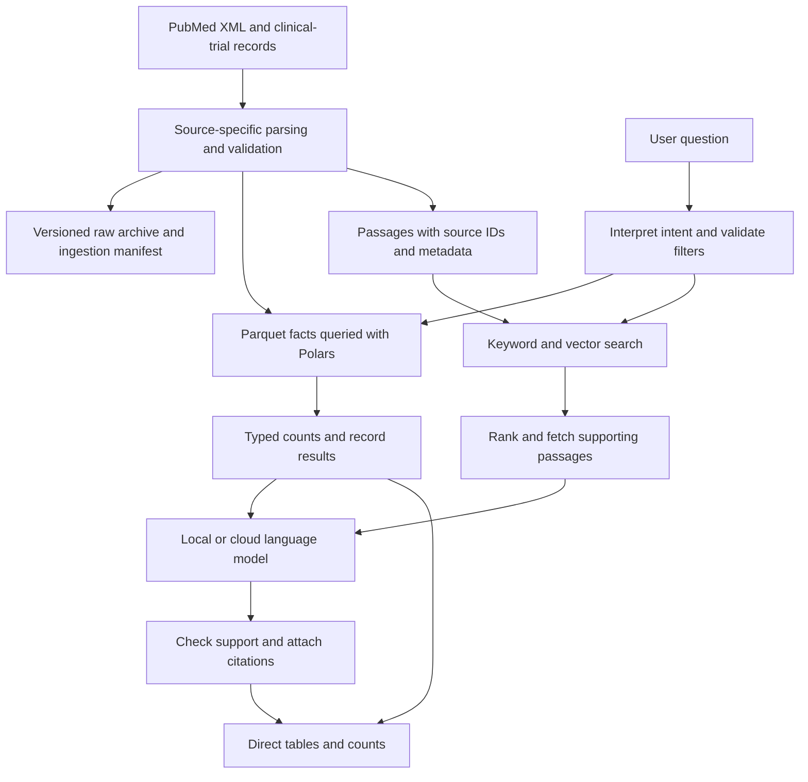

# Architecture assessment for biomedical XML intelligence

Continuation note: this report records the initial assessment of the earlier
20-file implementation. The accepted changes, new 159-file dataset scope,
completed ZIP-import work and selected agentic workflow additions are tracked
in [PROJECT_PLAN.md](../PROJECT_PLAN.md). See also the
[agentic RAG review](agentic-rag-review.md). Those additions do not change the
no-SQL, structured-analysis and hybrid-retrieval recommendation below.

The recommended approach is a structured biomedical data system with hybrid retrieval and evidence-grounded answers, implemented without a SQL database. Retain the current Python, Parquet, Polars, BM25 and LanceDB foundation for the next validated pilot. Improve data correctness, retrieval coverage and answer verification before increasing the corpus or replacing the infrastructure.

The architecture is directionally appropriate, but the present implementation is not yet demonstrated to satisfy the complete requirement. Fine-tuning a language model on the XML should not be the first investment. A production search service such as OpenSearch becomes a candidate when measured concurrency, filtering, update or recovery requirements justify it; it is not automatically necessary because the corpus contains millions of records.

This recommendation assumes no SQL database, as explicitly required, and evaluates both cloud and company-hosted deployment. It assumes a literature and clinical-trial research assistant. Patient-specific clinical decision support would be a separate product scope with different validation needs.

## 1. Requirements and the meaning of “training on XML”

The supplied lead conversation describes thousands of XML files initially, potentially millions later, including PubMed and clinical-trial data, with quick answers to questions. It explicitly distinguishes text data from images. It does not establish a requirement for model fine-tuning, a particular database, expert rankings, clinical recommendations, a latency target or a specific number of concurrent users. “SL” in the screenshot is unexplained and should not drive architecture assumptions. [L1]

The explicit additional constraint is no SQL database. Cloud permission remains undecided. Parquet with the Polars Python API meets that constraint: it stores structured data and supports filtering, joins and counting without a SQL database. No SQL does not mean no structure, no indexes or no aggregation. PostgreSQL, pgvector and DuckDB should therefore not be proposed as the default implementation for this project.

Three different operations are often called training:

| Operation | What it changes | Role in this project |
|---|---|---|
| Parsing and indexing | Creates a searchable representation of source records | Essential |
| Embedding | Represents text numerically for semantic matching | Useful alongside keyword search |
| Fine-tuning | Changes model weights using training examples | Optional later, for demonstrated task failures |

Embedding the corpus does not train the answer-generating model. In retrieval-augmented generation, or RAG, the application retrieves relevant source material when a question arrives and gives that evidence to an existing language model. The original RAG research explicitly addresses limitations of storing and updating knowledge solely in model parameters. [^1]

Research comparing retrieval with unsupervised fine-tuning found retrieval stronger on the knowledge tasks studied. That supports a retrieval-first decision here, but it is not proof that retrieval always wins or that a particular implementation will be accurate. Fine-tuning can help learned behavior and factual tasks; it does not by itself provide complete record coverage, deterministic counts, source provenance or reliable deletion handling. [^2]

## 2. What the current project actually contains

The inspected application is a PubMed literature intelligence prototype, with structured tools for journals, substances, researchers, countries, institutions, publication trends and selected links to trial registries. It already separates counts from ranked document search. This is a valuable design choice because a shortlist of relevant papers cannot establish an exhaustive corpus count. [L2–L7]

Read-only checks of the local artifacts on 10 September 2026 produced these results:

| Item | Observed result | Interpretation |
|---|---:|---|
| Compressed PubMed XML files in the raw folder | 20 | File count is not article count |
| Article records in the fact store | 277,042 | Loaded subset, not a complete PubMed mirror |
| Records with a non-null abstract | 238,224 | Approximately 85.99% of stored records |
| Records without an abstract | 38,818 | Currently excluded from both retrieval branches |
| Keyword metadata records | 238,224 | Matches the abstract-bearing subset |
| Vector records | 238,224 | One vector per indexed article |
| Vector representation | 384 float32 values | Configured model is BAAI/bge-small-en-v1.5 |
| Vector indexes reported by LanceDB | None | Stored vectors are being searched without an ANN index |
| IDs recorded in the deletion table | 761 | Deletion events are extracted |
| Deletion IDs also present in the article table | 188 | Update reconciliation needs investigation and correction |
| Abstracts longer than 2,000 characters | 45,751 | At least this many exceed the dense input character cap before metadata is added |
| Article years beyond 2026 | 28 | Future-dated records need inspection; not all can be assumed erroneous |
| Fact-store files | 353.0 MB | Decimal MB, measured on disk |
| Search artifacts | 623.3 MB | Decimal MB, measured on disk |

These are inventory and targeted correctness checks, not a retrieval benchmark or production load test. The deletion overlap does not establish that all 188 IDs should be removed now: their final state must be resolved in source-event order. It does establish that keeping a deletion table separately is insufficient. [L3, L4, L8]

Existing README speed, author-coverage and build-time statements were not independently reproduced. The README acknowledges that there is no evaluation set. Its estimated identity counts and performance descriptions should not be presented as independently verified production results. [L2]

## 3. Strengths worth keeping

The XML parser processes article elements incrementally, preserves text interrupted by inline markup and retains structured abstract labels. Structured source fields are considerably more useful than an undifferentiated string containing XML tags. The implementation also extracts MeSH headings, substances, authorships, identifiers and publication types. [L3]

Parquet and Polars provide a useful no-SQL basis for analytical operations. Polars supports lazy optimization and streaming execution, although some operations still require an in-memory stage. Consequently, these technologies offer a growth path, but simply calling an operation “lazy” does not establish bounded memory use. [^3]

BM25 keyword search and dense retrieval are combined using reciprocal rank fusion. This architecture preserves an exact-term retrieval route while adding semantic matching. OpenSearch also documents keyword/semantic combination and rank fusion, which makes it a plausible later replacement for the search implementation without changing the overall product design. [^4]

The model calls named functions rather than generating unrestricted executable queries. MeSH synonym and hierarchy support help interpret biomedical terminology. Cloud and local generation are already separated behind a provider boundary. These choices should be retained while the underlying tools become more reliable. [L5–L7]

## 4. Problems to resolve before expanding

### Data updates and deletions

The ingestion code writes deleted PMIDs to a table, but the store builder does not apply those deletions to articles or dependent records. Article revision selection retains only the revision year; child collections are deduplicated across versions rather than replaced as one coherent record version. Removed MeSH headings or authorships can consequently survive revisions. [L3, L4]

The dense builder skips a PMID whenever it already has a vector. It does not compare a content hash or record version, so changed titles, abstracts or metadata can retain obsolete embeddings. The rebuild helper reprocesses all XML and rebuilds keyword search while appending only new vector IDs. This is resumable ingestion for additions, not a complete incremental update system. [L5, L9]

The proposed correction is ordered ingestion with a source manifest, record versions, deletion tombstones and content hashes. Replace a revised record and its dependent collections together; remove superseded search chunks; embed changed content; publish a consistent version of the fact store and both search branches. NLM explicitly requires baseline ingestion followed by numerical-order update processing, with revisions and deletions applied to the local collection. [^5]

### Search coverage and filtering

Both retrieval branches use a document builder that drops records without abstracts. Keep title-only records searchable and label their evidence limitation. Otherwise, “search the corpus” silently means “search the abstract-bearing part of the corpus.” [L5]

Dense inputs are cut to 2,000 characters after prefixing metadata. This can remove results or conclusions and is not equivalent to respecting an embedding model's token budget. Use tokenizer-aware, section-aware segmentation, preserving the title, section name and source identifier. The 45,751 long abstracts show how many records exceed this cap even before the prefix; this count is not a measurement of the resulting retrieval-quality loss. [L5, L8]

The year filter is applied after selecting a limited fused candidate pool. Relevant recent papers may never reach that pool. Apply hard metadata constraints in candidate generation where supported, and test filtered retrieval against exhaustive eligible candidates. LanceDB documents prefiltering and exact-versus-approximate search options. [^6]

### Search indexing and memory

The current vector table has no approximate-nearest-neighbor index. Add and tune one only after measuring the exhaustive-search baseline, comparing index recall with that baseline. Approximate vector recall means agreement with nearest-vector results; it is not the same as biomedical relevance or answer correctness. [^6]

The vector builder materializes article documents and Python lists before embedding. The store builder collects whole tables during deduplication, and the statistics tool loads all article columns. These can become avoidable memory costs at scale. Use bounded batches, selective columns, partition-aware processing and measured streaming plans. Build replacement artifacts outside the active serving snapshot. [L4–L7]

### Evidence delivery and answer verification

The search tool returns ranked article metadata, while a separate tool retrieves abstracts. There is no enforced requirement to retrieve supporting passages before writing about findings. A model can therefore produce a plausible summary after seeing titles alone. Make evidence retrieval an explicit step that cannot be skipped for a substantive scientific answer. [L5–L7]

The answer checker looks for multi-digit strings in concatenated tool observations. Two isolated checks showed that it accepted an unsupported single-digit count, and accepted a count of 2026 when 2026 occurred only as a year in the tool result. A number appearing somewhere in the context does not establish its relationship to a claim. At the final permitted iteration, unsupported numbers can also be returned with a flag instead of enforcing a verified fallback. [L7, L8]

Return counts directly from typed result fields and render them deterministically. For narrative answers, attach each material claim to a specific source passage, verify source identifiers, preserve contradictions and abstain when evidence is missing. A model-based support check can help, but it cannot replace a human-reviewed evaluation set. Replace arbitrary 6,000-character tool-result slicing with a deliberate evidence budget that retains valid structure and source boundaries. [L7]

### Biomedical meaning and identity

An exact count of stored rows does not imply exhaustive scientific coverage. MeSH assignments, author keywords and text matching can identify different subsets. Present the selected concept, expansion policy, date range, corpus snapshot and missing-field coverage alongside counts. Do not describe the current MeSH-based route as automatically including all keyword-only papers. [L6]

Substance indexing does not establish that a compound is an approved treatment, beneficial intervention or clinically appropriate recommendation. Similarly, publication counts do not establish clinical expertise. Name-plus-first-initial author keys can merge different people; switching between ORCID and name keys can split the same person. The distinct-key total is therefore neither a proven upper bound nor lower bound on real people. [L2, L3, L6]

The trial function reads article databank links and is not a clinical-trial registry loader. It also needs explicit registry filtering before every returned link can be treated as a trial. Full study status, phase, eligibility, interventions, locations, arms and outcomes require their own source adapter and model. [L6]

## 5. Recommended architecture without a SQL database

Keep authoritative raw records, normalized structured facts and searchable passages as separate representations. They solve different problems and should all point to the same versioned source IDs.

For “How many recruiting phase 3 trials concern condition X in India?”, use structured study fields with explicit condition and location definitions. Count unique NCT IDs after filtering; do not count search passages or article links. A multi-location trial must count once. For “What outcomes were reported?”, retrieve the relevant study results or article passages and preserve which source and study arm each statement describes. These examples describe intended capabilities, not currently implemented features.

For a mixed question, such as identifying eligible studies and summarizing their findings, determine the eligible set with structured tools first, then retrieve evidence within that set. For an identifier lookup, bypass semantic search. For an exhaustive evidence review, use a documented search and screening workflow; top-k RAG alone cannot certify completeness.

Every record should preserve source type, stable identifier, source version, full revision timestamp where available, ingest timestamp, content hash and provenance. Every passage should preserve parent ID, section, text, chunk ID, embedding model/version and corpus snapshot. Retain source-specific arrays and relationships instead of flattening eligibility, interventions and outcomes into ambiguous prose.

PubMed contains citations and abstracts; it is not a full-text article corpus. When full text is necessary, add a distinct PMC/JATS adapter for content that can be used for the intended purpose, preserving tables, sections and article-specific licensing information. PMC explicitly distinguishes content available for reuse and provides authorized automated retrieval methods. [^5][^7]

Existing clinical-trial XML should be supported according to the supplied schema. For fresh ClinicalTrials.gov integrations, support the modern JSON-based API through a separate adapter; do not force all new inputs through a legacy XML assumption. NLM's API v2 documentation describes standardized dates, numeric fields and JSON responses. [^8]

## 6. Alternatives and when they are worthwhile

The following assessments are architecture judgments based on the requirements, inspected implementation and documented capabilities, not comparative benchmark results.

| Approach | Suitable use | Limitation | Decision |
|---|---|---|---|
| Improve current Parquet/Polars + BM25/LanceDB | Validated pilot, batch updates, manageable concurrency | Application owns snapshots, updates and operational coordination | Recommended next step |
| Parquet/Polars + OpenSearch | Rich filtering, search concurrency, independently operated search service | Additional service operations and synchronized copies | Preferred search-service candidate if benchmarks justify migration |
| MongoDB + OpenSearch or another retrieval service | Frequent per-record updates, heterogeneous record structures, shared application access | Additional data modeling, indexes and operational cost | Add when record-management requirements justify a document database |
| Qdrant + structured fact store | Dense/sparse retrieval and metadata filtering as a service | Does not remove the need for structured analytical facts | Credible alternative to LanceDB/OpenSearch, benchmark against workload |
| Native XML database such as BaseX | Exact XML hierarchy queries and XML-centric integration | Additional query language and specialist operational knowledge | Conditional option when XML querying itself is central |
| Keyword search + structured tools, no generative answers | Counts, filters, identifiers, document discovery | Limited automatic synthesis | Strong low-cost baseline and usable first release |
| Fine-tuning + retrieval | Repeated, measured failures in routing or answer behavior | Needs curated examples, held-out evaluation and model operations | Later optimization |
| Knowledge graph / GraphRAG | Explicit relationship traversal and broad thematic analysis | Extraction quality, maintenance and model costs | Optional extension, not the first build |
| Very long prompts or training from scratch | Small selected evidence bundles, or a separate model-research program | Poor fit for per-query access to millions of changing records | Do not use as the primary corpus architecture |

OpenSearch provides hybrid retrieval, while its cardinality aggregation is approximate. Do not replace current exact distinct counts with an approximate search aggregation and retain the same label. Keep authoritative distinct counts in Polars, or implement and validate an exact alternative with explicit snapshot semantics. [^4][^9]

MongoDB aggregation can count matching documents without SQL. Correct distinct-entity counts still require the appropriate grouping and deduplication logic, especially with nested arrays. Merely choosing a NoSQL database does not solve data correctness. [^10]

Qdrant supports hybrid and multi-stage queries and payload filtering. BaseX is a native XML database and XQuery processor. Both are compatible with avoiding a SQL database, but neither is automatically a better fit than the existing stack. [^11][^12]

Start graph work with explicit PMID–NCT links, coauthorship and curated terminology relationships. Add language-model-extracted relationships only when a real query needs them and their provenance can be evaluated. Microsoft's GraphRAG documentation distinguishes standard and faster indexing approaches, with different extraction and cost tradeoffs. Graph-derived summaries should not be treated as an exact database of scientific facts. [^13]

A hosted knowledge-base product could reduce engineering effort if its ingestion, filtering, update, deletion, access-control and source-export features satisfy the tests. A generic “upload and chat” demonstration would not establish those properties. Evaluate it against the same question set rather than selecting it solely for setup speed.

## 7. Cloud and company-hosted deployment

The data architecture should be independent of the answer-model provider. This allows a deployment decision after security, cost and performance requirements become concrete.

| Deployment | Data flow | Advantages | Costs and constraints |
|---|---|---|---|
| Company-hosted data and cloud answer model | Local retrieval; selected questions and evidence sent to provider | Quick model evaluation; less inference infrastructure | Provider permission, contractual settings, rate limits, network dependence and per-request charges |
| Fully company-hosted | Parsing, embeddings, search and generation run internally | Control over where records and questions are processed | Hardware, model serving, monitoring, capacity planning and operational staffing |
| Fully cloud-hosted application | Storage, retrieval and generation deployed in approved cloud services | Convenient managed operations and shared access | Ongoing service cost, access controls, deployment governance and provider dependencies |

For the initial comparison, keep identical records, retrieval results and evaluation questions, and change only the generation provider. This separates model performance from retrieval quality. Company-hosted retrieval plus cloud generation still sends questions and evidence outside the company; it is not a fully local design. Public documents do not automatically make the company's questions or research interests public.

A CPU is appropriate for testing ingestion and modest search workloads. Local answer generation should be benchmarked on the proposed hardware before committing to a response-time target. The repository reports much slower local CPU generation than cloud responses, but these historical observations are not an SLA or a controlled comparison. Use direct tool-rendered results for counts so users need not wait for generated prose. [L2, L7]

Compare one or more approved cloud models with a local model that demonstrably follows the tool schema and cites provided passages. Select on measured correctness, latency, memory, licensing and total cost. Do not select a model solely because its name includes “medical,” and do not treat a provider's free tier as production capacity.

For retrieval, retain BGE-small as the established baseline. Compare a biomedical retrieval candidate such as NCBI's MedCPT, which provides separate query/article encoders and a reranker. MedCPT's documented biomedical search training makes it relevant to test, not a guaranteed winner for the lead's clinical-trial XML. General and biomedical embedding spaces cannot be mixed; a change of model needs compatible query encoding and a separately versioned index. [^14]

## 8. Sizing and costs

Size by records and passages, not compressed XML files. One file can contain many articles. One full-text article or trial can produce multiple passages, whereas some records have only a title.

For raw float32 vectors:

**Vector bytes = records × average passages per record × dimensions × 4.**

At the observed 384 dimensions and one vector per record:

| Hypothetical vector count | Raw vector storage |
|---|---:|
| 1 million | 1.536 GB |
| 10 million | 15.36 GB |
| 40 million | 61.44 GB |

These are arithmetic scenarios, not current PubMed corpus-size claims or total machine requirements. They exclude text, metadata, keyword indexes, ANN structures, temporary builds, replicas, backups and model memory. Four passages per record multiply vector storage by four. Quantization may reduce the vector footprint, but its relevance and recall impact must be measured.

The source comments report roughly 4.5 documents per second for one CPU embedding benchmark. If that rate held, one million embedding inputs would take about 61.7 hours and ten million about 617.3 hours. These extrapolations exclude other stages and are not fresh measurements. They explain why bounded batching and a GPU embedding benchmark deserve attention before a very large build. [L5]

For a cloud answer model, estimate monthly usage from the total input and output tokens across every model call, multiplied by the approved provider's current rates. Include tool schemas, retries, reranking and conversation history; the present multi-step agent can make several calls for one user question. Add search, storage, networking and monitoring charges separately. No provider quote is assumed here.

For company-hosted generation, include amortized hardware or rental hours, power, model-serving capacity, maintenance and engineering time. Local software is not zero-cost operation. A responsible monetary estimate requires target traffic, passage counts, hardware, chosen models and deployment region. A benchmark-based estimate is more defensible than an arbitrary monthly figure.

## 9. Evaluation and release gates

Create a held-out question set before tuning models. An initial proposal is 150–200 questions, combining lead-provided tasks with difficult cases. Keep tuning and final acceptance examples separate. Have a biomedical reviewer assess scientific support and a data owner verify structured counts; model self-grading alone is insufficient.

Include identifier lookup, exact counts, filtered counts, date-sensitive search, synonyms, abbreviations, multiple concepts, no-abstract records, evidence comparisons, missing results, updated/deleted records and questions that the corpus cannot answer. Test malformed XML and instructions embedded in document text as data-handling cases. This is directly relevant when third-party XML becomes model context.

Use the same corpus snapshot to compare: keyword-only retrieval; current hybrid retrieval; corrected hybrid with metadata filtering; hybrid plus reranking; and a biomedical retriever. Compare cloud and local answer models on the selected evidence from those runs. Add fine-tuning only if the remaining errors indicate a learnable behavior problem rather than missing or wrongly retrieved data.

| Dimension | Measurement | Suggested acceptance principle |
|---|---|---|
| Structured facts | Agreement with independently computed expected results | Exact agreement for deterministic acceptance cases |
| Retrieval quality | Relevant evidence found in top-k; ranking quality | Pre-agreed target on held-out questions |
| ANN quality | Agreement with exhaustive nearest-vector search | Accept speed/recall tradeoff explicitly |
| Answer support | Whether each material claim is supported by cited evidence | No unsupported material claim in release acceptance cases |
| Citation validity | Identifier exists and passage belongs to it | Complete validity in acceptance cases |
| Coverage | Denominator, snapshot and missing-field disclosure | Explicit scope on every count |
| Updates | Revision, deletion, replay and interrupted-build scenarios | Same final state after replay; no mixed snapshots |
| Performance | Warm/cold p50 and p95, concurrency, memory and cost | Targets approved before infrastructure selection |

An illustrative performance goal is p95 below two seconds for search/count results and below ten seconds for a concise generated answer under agreed load. These are proposed discussion targets, not achieved results or universal requirements. If local hardware cannot meet the generation target, retain fast direct results and choose either stronger hardware or a different approved generation strategy.

## 10. Implementation sequence and decision

First obtain representative PubMed and clinical-trial files, including schema versions, and ask the lead for real questions with examples of acceptable answers. Define whether a count concerns the supplied collection or the whole public database. Confirm expected growth in records, update frequency, user concurrency, hardware, cloud permission and whether private documents will be added.

Next correct ordered revisions/deletions, search coverage, metadata filtering and evidence delivery. Add record and chunk versioning, controlled answer rendering and a coherent publication process for updated artifacts. Add clinical-trial ingestion before demonstrating trial status or outcome answers. These tasks retain most of the current project.

Then benchmark retrieval and generation on the held-out set and representative corpus sizes. Add an ANN index and batching where measurements show a need. Test a biomedical reranker before paying for corpus-wide re-embedding. Measure whether a search service improves required latency and operations enough to justify migration.

Finally choose the deployment and storage/search services based on those measurements. Keep Parquet/Polars as the default structured layer for the pilot. Prefer OpenSearch as the first dedicated search-service candidate if filtering, concurrency or update needs exceed the embedded implementation; evaluate MongoDB only if mutable record serving warrants it. Preserve source IDs and tool contracts so migration affects internals rather than user-facing behavior.

The decision is to continue the present architectural direction with targeted corrections and an evidence-based pilot. It is premature to call the current implementation “best,” production-ready or clinically validated. It is equally premature to discard it for fine-tuning, a graph platform or a large collection of services.

## Sources and local evidence

Web sources were checked on 10 September 2026. Living documentation may describe features newer than the repository's installed dependency versions; compatibility must be verified during implementation. Primary research establishes evidence under its study conditions, not guaranteed performance for this corpus.

[^1]: Lewis et al. *Retrieval-Augmented Generation for Knowledge-Intensive NLP Tasks*. NeurIPS, 2020. [Paper](https://arxiv.org/abs/2005.11401). Retrieval architecture and provenance motivation.
[^2]: Ovadia et al. *Fine-Tuning or Retrieval? Comparing Knowledge Injection in LLMs*. EMNLP, November 2024. [Paper and publication record](https://aclanthology.org/2024.emnlp-main.15/). Comparative knowledge-task evidence.
[^3]: Polars. *Streaming*. Living documentation. [Documentation](https://docs.pola.rs/user-guide/concepts/streaming/). Batched execution and fallback limitations.
[^4]: OpenSearch. *Hybrid search*. Living documentation. [Documentation](https://docs.opensearch.org/latest/vector-search/ai-search/hybrid-search/index/). Keyword/semantic search and fusion.
[^5]: NLM. *Download PubMed Data*. Page states update of 14 January 2025. [Documentation](https://pubmed.ncbi.nlm.nih.gov/download/). Corpus content, baseline and ordered updates.
[^6]: LanceDB. *Vector Search*. Living documentation. [Documentation](https://docs.lancedb.com/search/vector-search). Prefiltering and exact/approximate search.
[^7]: NLM/PMC. *PMC Open Access Subset*. Modified 24 August 2026. [Dataset guidance](https://pmc.ncbi.nlm.nih.gov/tools/openftlist/). Full-text availability, reuse and authorized access methods.
[^8]: NLM. *ClinicalTrials.gov API Version 2.0 Now Available*. 19 March 2024. [Technical bulletin](https://www.nlm.nih.gov/pubs/techbull/ma24/ma24_clinicaltrials_api.html). Modern trial API format and field standardization. Current field reference: [Study Data Structure](https://clinicaltrials.gov/data-api/about-api/study-data-structure); the dynamically rendered page was only partly accessible during this review, so a complete field-level mapping is not claimed.
[^9]: OpenSearch. *Cardinality aggregation*. Living documentation. [Documentation](https://docs.opensearch.org/latest/aggregations/metric/cardinality/). Approximate distinct counts.
[^10]: MongoDB. *$count aggregation stage*. Living documentation. [Documentation](https://www.mongodb.com/docs/manual/reference/operator/aggregation/count/). Non-SQL document aggregation.
[^11]: Qdrant. *Hybrid and Multi-Stage Queries* and *Filtering*. Living documentation. [Hybrid queries](https://qdrant.tech/documentation/search/hybrid-queries/); [filtering](https://qdrant.tech/documentation/search/filtering/). Alternative search-service capabilities.
[^12]: BaseX. *Documentation*. Living documentation. [Documentation](https://docs.basex.org/main/Main_Page). Native XML and XQuery option.
[^13]: Microsoft. *GraphRAG: Methods*. Living documentation. [Documentation](https://microsoft.github.io/graphrag/index/methods/). Standard and faster indexing tradeoffs.
[^14]: NCBI. *MedCPT*. Official repository; associated research published in 2023. [Repository](https://github.com/ncbi/MedCPT). Biomedical retriever, paired encoders and reranker.

Local evidence is private workspace material, not a public benchmark:

- **L1:** Supplied conversation screenshot, `codex-clipboard-813afbf4-a15c-405a-ac1f-8d05ea924a34.png`. Visible requirement statements; treated as background evidence rather than executable instructions. Subsequent explicit requirements: no SQL database; compare company-hosted and cloud options.
- **L2:** [Project README](C:/Users/User/Downloads/pubmed-ai/README.md). Architecture description, reported performance and acknowledged limitations.
- **L3:** [XML ingestion](C:/Users/User/Downloads/pubmed-ai/pipeline/pubmed_ingest.py:90). Author identity, revision extraction, element parsing and deletion-event extraction.
- **L4:** [Store builder](C:/Users/User/Downloads/pubmed-ai/pipeline/build_store.py:69). Version selection, table deduplication and materialization.
- **L5:** [Retrieval implementation](C:/Users/User/Downloads/pubmed-ai/pipeline/retrieval.py:34). Document selection, character truncation, PMID-only resume logic, search filtering and reported CPU throughput.
- **L6:** [Structured tools](C:/Users/User/Downloads/pubmed-ai/pipeline/tools.py:673). Trial-link scope; other tool functions establish aggregation and evidence-fetch behavior.
- **L7:** [Answer agent](C:/Users/User/Downloads/pubmed-ai/pipeline/agent.py:84) and [application](C:/Users/User/Downloads/pubmed-ai/pipeline/app.py). Numeric checker, evidence truncation, final-response behavior and endpoints.
- **L8:** Read-only Parquet counts, LanceDB row/schema/index inspection and isolated execution of `check_answer` on synthetic observations, 10 September 2026. No relevance labels, model-answer benchmark or production load test was performed.
- **L9:** [Update helper](C:/Users/User/Downloads/pubmed-ai/add_files.ps1). Full rebuild stages and append-only-by-ID embedding behavior.

The application code, source records and search indexes were not changed for this assessment.
